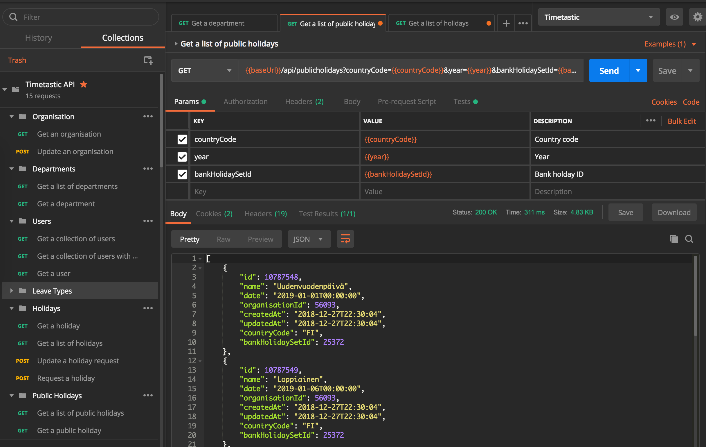

# [Timetastic][timetastic]-postman
Postman Collection + Environment for [Timetastic API][timetastic-api], a placeholder to maintain Timetastic API Postman 
Collections (not owned by Timetastic).
Please follow this tutorial to import this [Postman Collection][pm-collection].

## DONE
- [x] Export Timetastic Swagger JSON to Postman
- [x] Modify endpoints to work with environment variables
- [x] Add all endpoints for each categories (Departments, users, holidays, public holidays, leave types and organisation)
- [x] Add environment variables

## TODOs
- [ ] Split endpoints which have filters
- [ ] Add more examples for error response

## Author
[Dawit Nida](https://github.com/dawitnida)

[timetastic]: <https://app.timetastic.co.uk>
[timetastic-api]: <https://app.timetastic.co.uk/apidocs>
[pm-collection]: <https://www.getpostman.com/docs/collections>
